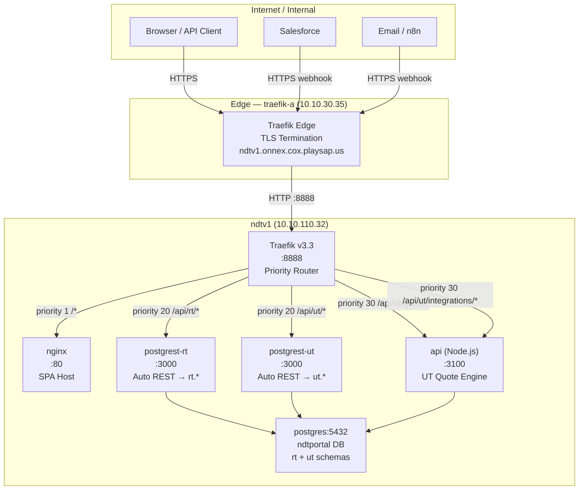
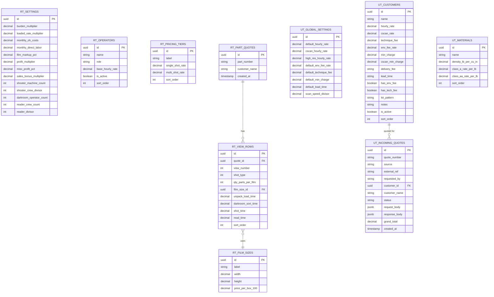
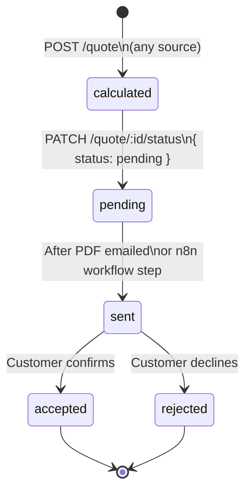
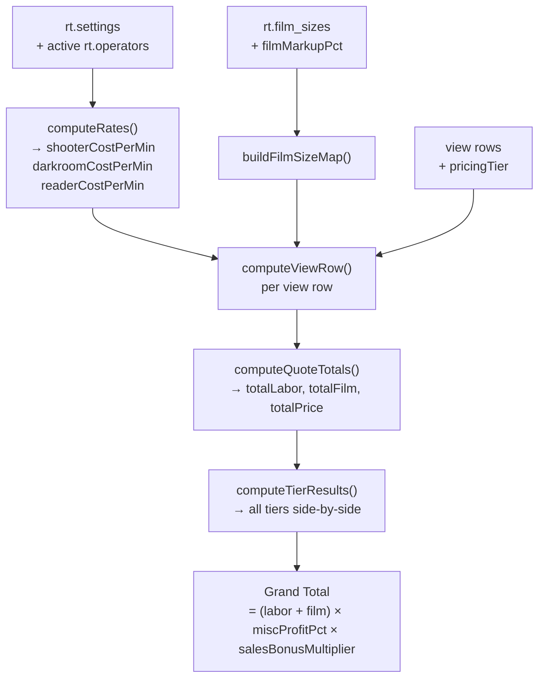
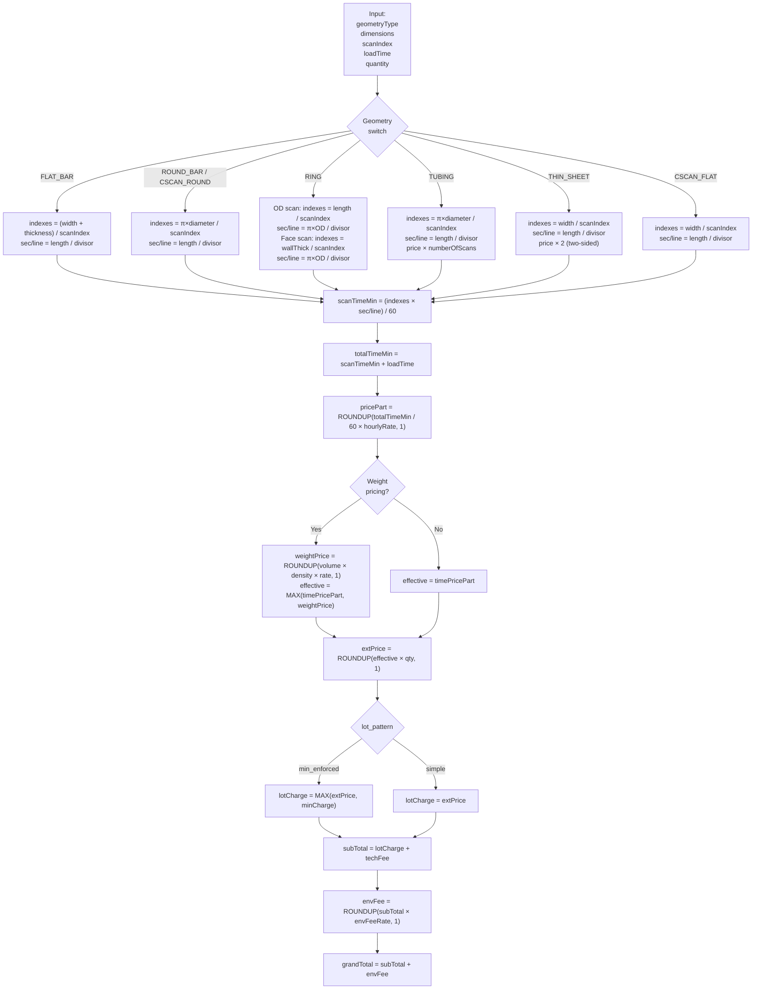
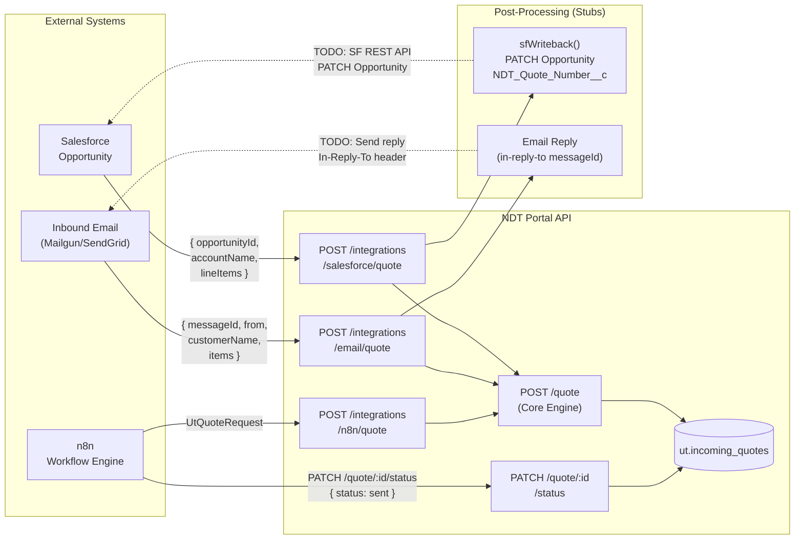
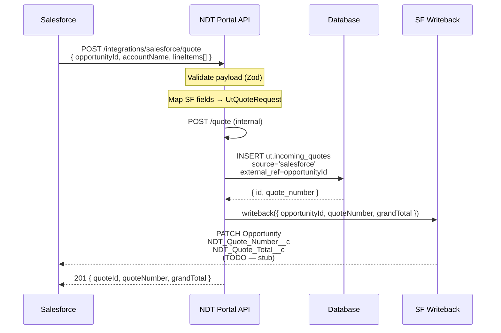
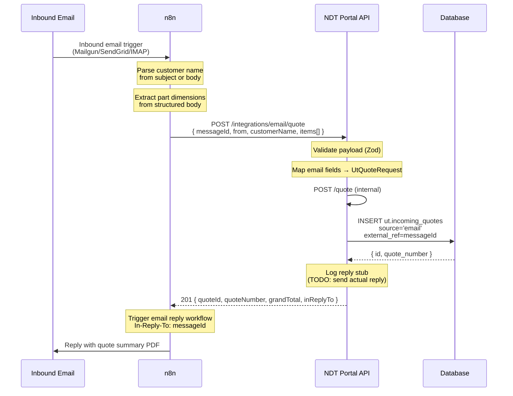
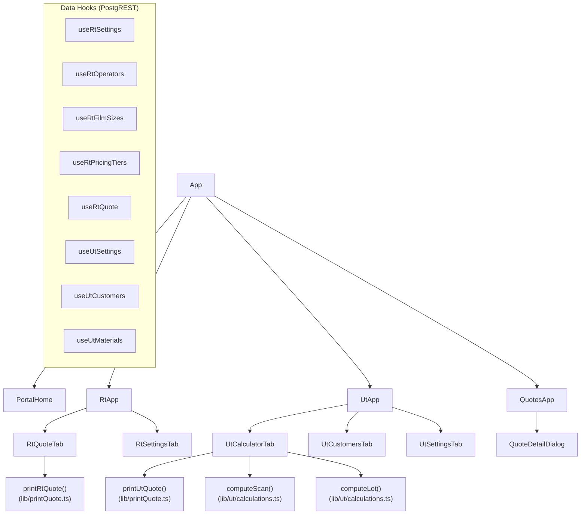

# NDT Portal — Technical Documentation

**Version:** 2.0
**Updated:** 2026-03-15
**URL:** https://ndtv1.onnex.cox.playsap.us
**Host:** ndtv1 (10.10.110.32) · Proxmox pve-6029u · VLAN 110
**Source:** /opt/ndt-portal/
**Owner:** Onnex AI Agency

---

## Table of Contents

1. [Overview](#1-overview)
2. [System Architecture](#2-system-architecture)
3. [Infrastructure & Stack](#3-infrastructure--stack)
4. [Database Schema](#4-database-schema)
5. [RT Costing Calculator](#5-rt-costing-calculator)
6. [UT Price Calculator](#6-ut-price-calculator)
7. [UT Quote API — Full Reference](#7-ut-quote-api--full-reference)
8. [Integration Points](#8-integration-points)
9. [Frontend Application](#9-frontend-application)
10. [Operations & Deployment](#10-operations--deployment)
11. [Calibration Record](#11-calibration-record)

---

## 1. Overview

The NDT Portal replaces two Excel-based costing workbooks with a self-hosted, production-grade web application:

| App | Replaces | Purpose |
|-----|----------|---------|
| **RT Costing Calculator** | 236-column Excel spreadsheet | X-ray (radiographic) inspection job quotes — labor, film costs, multi-tier pricing |
| **UT Price Calculator** | 40+ sheet Excel workbook | Ultrasonic inspection quotes — 7 geometry types, 30 customers, weight-based pricing |

Both apps share a single Postgres database, a single React SPA, and are exposed through a unified Traefik reverse proxy. A REST API layer on the UT calculator enables Salesforce CRM and email automation.

---

## 2. System Architecture

### 2.1 Network & Infrastructure

```
┌─────────────────────────────────────────────────────────────────┐
│  Internet / Internal Network                                     │
└────────────────────────┬────────────────────────────────────────┘
                         │ HTTPS
                         ▼
              ┌──────────────────────┐
              │   traefik-a          │  10.10.30.35
              │   (Edge Traefik)     │  TLS termination
              │   srv-ndtv1.yml      │  ndtv1.onnex.cox.playsap.us
              └──────────┬───────────┘
                         │ HTTP :8888
                         ▼
              ┌──────────────────────────────────────────────────┐
              │  ndtv1  (10.10.110.32)  ·  VLAN 110              │
              │  /opt/ndt-portal/                                 │
              │                                                   │
              │  ┌─────────────────────────────────────────────┐ │
              │  │  Traefik v3.3  (:8888)  file provider        │ │
              │  │                                             │ │
              │  │  Priority routing (traefik-dynamic.yml):    │ │
              │  │    30  /api/ut/quote/*  →  api:3100         │ │
              │  │    20  /api/rt/*        →  postgrest-rt      │ │
              │  │    20  /api/ut/*        →  postgrest-ut      │ │
              │  │     1  /*               →  nginx:80          │ │
              │  └──────────────────────────────────────────── ┘ │
              │                                                   │
              │  nginx:80           React SPA (dist/)             │
              │  postgrest-rt:3000  Auto REST — schema: rt        │
              │  postgrest-ut:3000  Auto REST — schema: ut        │
              │  api:3100           UT Quote calculation engine   │
              │  postgres:5432      Single DB: ndtportal          │
              │    ├── schema: rt   (RT calculator data)          │
              │    └── schema: ut   (UT calculator data)          │
              └──────────────────────────────────────────────────┘
```

### 2.2 Container Architecture (Mermaid)



### 2.3 Request Routing

| Path Pattern | Priority | Handler | Notes |
|---|---|---|---|
| `/api/ut/quote/*` | 30 | `api:3100` | Quote engine, integrations |
| `/api/ut/integrations/*` | 30 | `api:3100` | SF, email, n8n webhooks |
| `/api/rt/*` | 20 | `postgrest-rt` | RT PostgREST, strips `/api/rt` |
| `/api/ut/*` | 20 | `postgrest-ut` | UT PostgREST, strips `/api/ut` |
| `/*` | 1 | `nginx:80` | React SPA fallback |

---

## 3. Infrastructure & Stack

### 3.1 Frontend

| Layer | Technology |
|-------|-----------|
| Framework | React 19 |
| Bundler | Vite 8 |
| Language | TypeScript 5.9 |
| Styling | Tailwind CSS v3 |
| UI Components | Radix UI + shadcn/ui (CVA + clsx + tailwind-merge) |
| Icons | Lucide React |
| Routing | React Router v7 |
| State | Local React state + custom hooks |

No Next.js, no SSR, no TanStack Query — pure SPA hitting PostgREST directly and the custom Express API.

### 3.2 Backend API

| Layer | Technology |
|-------|-----------|
| Runtime | Node.js 20 |
| Framework | Express 4 |
| Language | TypeScript 5.4 |
| DB client | pg (node-postgres) |
| Validation | Zod |
| Security | Helmet, cors |

### 3.3 Data Layer

| Component | Technology | Role |
|-----------|-----------|------|
| Database | PostgreSQL 16 | Single DB `ndtportal`, schemas `rt` + `ut` |
| Auto REST (RT) | PostgREST v12 | Exposes `rt.*` tables as REST — no custom code |
| Auto REST (UT) | PostgREST v12 | Exposes `ut.*` tables as REST — no custom code |

### 3.4 Infrastructure

| Component | Technology |
|-----------|-----------|
| Reverse proxy (internal) | Traefik v3.3 — file provider, priority routing |
| Reverse proxy (edge) | traefik-a — TLS termination, external routing |
| Static file server | nginx 1.27 |
| Container orchestration | Docker Compose |
| Host OS | Proxmox VM, VLAN 110 |

---

## 4. Database Schema

### 4.1 Schema Overview (Mermaid ER)



### 4.2 Schema: rt (Radiographic Testing)

| Table | Rows | Purpose |
|-------|------|---------|
| `rt.settings` | 1 | Singleton — cost parameters + crew configuration |
| `rt.film_sizes` | 8 | Standard film sizes with pricing |
| `rt.operators` | 14 | SHOOTER / DARKROOM_SORT / READER roles |
| `rt.pricing_tiers` | 10 | Price tiers ($/sq-inch rates) |
| `rt.part_quotes` | — | Quote header (part number + customer) |
| `rt.view_rows` | — | Individual view entries per quote |

### 4.3 Schema: ut (Ultrasonic Testing)

| Table | Rows (seed) | Purpose |
|-------|-------------|---------|
| `ut.global_settings` | 1 | Singleton — default rates + scan parameters |
| `ut.customers` | 30 | Customer rate profiles |
| `ut.materials` | 5 | Material densities + Class A/AA rates |
| `ut.quotes` | — | Quote headers |
| `ut.line_items` | — | Part lines per quote |
| `ut.incoming_quotes` | — | Full audit log — all sources (portal/api/SF/email) |

### 4.4 Quote Lifecycle States



---

## 5. RT Costing Calculator

**URL:** `/rt`
**Source:** `frontend/src/components/rt/`
**Data:** PostgREST on `rt.*` tables

### 5.1 Calculation Chain



### 5.2 Rate Computation

```
avgShooterRate  = mean(active shooter base_hourly_rate)
avgDarkroomRate = mean(active darkroom_sort base_hourly_rate)
avgReaderRate   = mean(active reader base_hourly_rate)

shooterCostPerMin  = (avgShooter  × burden × loadedRate) / shooterCrewDivisor / 60
darkroomCostPerMin = (avgDarkroom × burden × loadedRate) / 60
readerCostPerMin   = (avgReader   × burden × loadedRate) / readerDivisor / 60
```

### 5.3 View Row Cost Rules (Critical)

| Component | Formula | Notes |
|-----------|---------|-------|
| Shooter cost | `(loadTime + shotTime) × shooterCostPerMin / qty` | **No shotType multiplier** |
| Darkroom cost | `sortTime × shotType × darkroomCostPerMin / qty` | shotType multiplier applied |
| Reader cost | `readTime × shotType × readerCostPerMin / qty` | shotType multiplier applied |
| Film cost (single) | `sqInches × singleShotRate × 1 / qty` | |
| Film cost (multi) | `sqInches × multiShotRate × shotType / qty` | |

### 5.4 Grand Total Formula

```
grandTotal = (totalLabor + totalFilm) × (1 + miscProfitPct) × salesBonusMultiplier
```

### 5.5 Default Settings

| Parameter | Default | Description |
|-----------|---------|-------------|
| burden_multiplier | 1.16 | Overhead burden on base labor |
| loaded_rate_multiplier | 3.0 | Loaded labor multiplier |
| film_markup_pct | 0.10 | Film cost markup |
| profit_multiplier | 0.45 | Profit target |
| misc_profit_pct | 0.15 | Misc profit |
| sales_bonus_multiplier | 1.02 | Sales bonus factor |
| shooter_crew_divisor | 4 | Shooter crew divisor |
| reader_divisor | 3 | Reader cost divisor |

---

## 6. UT Price Calculator

**URL:** `/ut`
**Source:** `frontend/src/components/ut/`
**Data:** PostgREST on `ut.*` tables + api:3100

### 6.1 Calculation Engine Flow



### 6.2 Geometry Types

| Type | Required Dims | Index Direction | Scan Direction | Rate |
|------|--------------|----------------|----------------|------|
| FLAT_BAR | thickness, width, length | width + thickness | length | hourlyRate |
| ROUND_BAR | diameter, length | π×diameter | length | hourlyRate |
| RING | OD, ID, length | length (OD) + wallThickness (face) | π×OD | hourlyRate |
| TUBING | diameter, length | π×diameter | length | 250 (high-res) |
| CSCAN_FLAT | thickness, width, length | width | length | cScanRate |
| CSCAN_ROUND | diameter, length | π×diameter | length | cScanRate |
| THIN_SHEET | thickness, width, length | width | length | hourlyRate × 2 |

### 6.3 FLAT_BAR Calibration Note

> **Calibration fix applied 2026-03-15** (commit `c0521f0`)
>
> The index formula was corrected from `width / scanIndex` → `(width + thickness) / scanIndex`.
>
> Physical basis: UT scans all four sides of a bar. The total scan width per pass is the
> sum of one wide face (width) and one edge face (thickness).
>
> Validation case (PREMCO, from source Excel workbook):
>
> | Input | Value |
> |-------|-------|
> | Thickness | 3.625" |
> | Width | 11.625" |
> | Length | 15.75" |
> | Scan index | 0.125" |
> | Load time | 3 min |
> | Rate | $225/hr |
>
> | Metric | Before fix | After fix |
> |--------|-----------|-----------|
> | Indexes | 93 | **122** |
> | Scan time | 2.441 min | **3.203 min** |
> | Total time | 5.441 min | **6.203 min** |
> | Price/part | $20.50 | **$23.30 ✓** |
>
> The `scan_speed_divisor` (10) was confirmed correct. No change needed.

### 6.4 Scan Speed Divisor

`scan_speed_divisor = 10` — hardware constant representing equipment scan rate (in./sec).

```
sec_per_scanline = scan_dimension / scan_speed_divisor
```

Applied consistently across all geometry types. Configurable via UT Settings tab (stored in `ut.global_settings.scan_speed_divisor`).

### 6.5 Seeded Customers (30)

PREMCO, ACTION INDUSTRIES, ACUTEK US, ALLOY METALS, ALTEMP ALLOYS, AVIATION METALS, AXXIS CORP, BLUELINE INDUSTRIES, CALIFORNIA METALS, FALCON ENGINEERING, HUB METALS, INDEPENDENT FORGE, JR MACHINE, LEADING EDGE, LEAN MANUFACTURING, MAGNA TOOL, MCNEELEY MFG, OLYMPIC AVIATION, PRECISION WATERJET, PROGRESSIVE ALLOY, Q&L METALS, RAM ALLOYS, RED LION, RICKARD SPECIALTY, SA AEROSPACE, SIERRA ALLOYS, SUPERIOR HANDFORGE, TOOLCRAFT, TRITON ALLOYS, TRUE STEEL.

### 6.6 Materials (5)

| Material | Density (lb/in³) | Class A ($/lb) | Class AA ($/lb) |
|----------|-----------------|----------------|-----------------|
| Mild steel | 0.283 | $0.14 | — |
| Stainless steel | 0.290 | $0.12 | $0.14 |
| Aluminum | 0.100 | $0.16 | — |
| Titanium | 0.160 | $0.20 | $0.25 |
| Nickel alloys | 0.2965 | $0.14 | $0.16 |

---

## 7. UT Quote API — Full Reference

**Base URL:** `https://ndtv1.onnex.cox.playsap.us/api/ut`

### 7.1 Endpoints

| Method | Path | Description |
|--------|------|-------------|
| GET | `/quote/health` | Service health check |
| POST | `/quote` | Submit quote → returns full priced quote |
| GET | `/quote` | List last 50 quotes (all sources) |
| GET | `/quote/:id` | Get quote by UUID |
| PATCH | `/quote/:id/status` | Advance quote lifecycle status |
| POST | `/integrations/salesforce/quote` | Salesforce webhook stub |
| POST | `/integrations/email/quote` | Email intake stub |
| POST | `/integrations/n8n/quote` | Generic n8n passthrough |

### 7.2 POST /quote

**Request:**
```json
{
  "customerId":   "uuid — optional, use OR customerName",
  "customerName": "PREMCO",
  "source":       "api | salesforce | email | portal",
  "externalRef":  "SF Opportunity ID / email Message-ID",
  "requestedBy":  "user or system name",
  "notes":        "free-form notes",
  "items": [
    {
      "partNumber":    "AM-001",
      "geometryType":  "FLAT_BAR",
      "thickness":     3.625,
      "width":         11.625,
      "length":        15.75,
      "scanIndex":     0.125,
      "loadTime":      3.0,
      "quantity":      200,
      "useWeightPricing": false
    }
  ]
}
```

**Required dimensions by geometry:**

| geometryType | Required fields |
|---|---|
| FLAT_BAR, CSCAN_FLAT, THIN_SHEET | thickness, width, length |
| ROUND_BAR, CSCAN_ROUND | diameter, length |
| RING | outerDiameter, innerDiameter, length |
| TUBING | diameter, length |

**Response (201):**
```json
{
  "quoteId":     "uuid",
  "quoteNumber": "UT-2026-1000",
  "generatedAt": "2026-03-15T10:00:00.000Z",
  "source":      "api",
  "customer":    { "name": "PREMCO", "hourlyRate": 225, ... },
  "items": [{
    "geometryType": "FLAT_BAR",
    "dimensions":   { "thickness": 3.625, "width": 11.625, "length": 15.75 },
    "scanParameters": {
      "scanIndex": 0.125, "indexes": 122, "secPerScanline": 1.575,
      "scanTimeMin": 3.203, "totalTimeMin": 6.203, "hourlyRate": 225
    },
    "pricing": {
      "timePricePart": 23.3, "effectivePricePart": 23.3,
      "quantity": 200, "extPrice": 4660, "lotCharge": 4660,
      "techFee": 0, "subTotal": 4660, "envFee": 93.2, "grandTotal": 4753.2
    }
  }],
  "summary": {
    "itemCount": 1, "totalParts": 200, "totalGrand": 4753.2,
    "leadTime": "4-5 Days", "deliveryFee": "No"
  }
}
```

**Errors:**

| HTTP | code | Cause |
|------|------|-------|
| 400 | `VALIDATION_ERROR` | Missing required field or bad geometry |
| 404 | `CUSTOMER_NOT_FOUND` | customerId / customerName not found |
| 404 | `MATERIAL_NOT_FOUND` | materialId not found |
| 500 | `INTERNAL_ERROR` | Unexpected server error |

### 7.3 PATCH /quote/:id/status

```json
{ "status": "sent" }
```

Valid transitions: `calculated → pending → sent → accepted | rejected`

**Response:**
```json
{ "id": "uuid", "quoteNumber": "UT-2026-1000", "status": "sent" }
```

---

## 8. Integration Points

### 8.1 Architecture Overview



### 8.2 Salesforce Integration

#### Flow



#### Salesforce Field Mapping

| Salesforce Field | NDT Portal | Notes |
|-----------------|-----------|-------|
| `Opportunity.Id` | `externalRef` | Stored for writeback |
| `Account.Name` | `customerName` | Matched against `ut.customers.name` |
| `User.Email` | `requestedBy` | Who triggered the Flow |
| `Opportunity.Description` | `notes` | Free-form |
| `LineItem.ProductCode` | `partNumber` | Echoed in response |
| `LineItem.Geometry__c` | `geometryType` | Custom field — must match enum |
| `LineItem.Thickness__c` | `thickness` | Custom field |
| `LineItem.Width__c` | `width` | Custom field |
| `LineItem.Length__c` | `length` | Custom field |
| `LineItem.Quantity` | `quantity` | Standard field |

**Writeback fields on Opportunity (create in SF):**

| Field API Name | Type | Value |
|---|---|---|
| `NDT_Quote_Number__c` | Text(20) | `UT-2026-1000` |
| `NDT_Quote_Total__c` | Currency | `4753.20` |
| `NDT_Quote_Status__c` | Picklist | `Calculated` |
| `NDT_Quote_Date__c` | DateTime | ISO 8601 timestamp |

#### To Activate

1. Add to `docker-compose.yml` environment:
   ```
   SF_INSTANCE_URL=https://yourorg.my.salesforce.com
   SF_CLIENT_ID=<Connected App consumer key>
   SF_CLIENT_SECRET=<Connected App consumer secret>
   SF_USERNAME=<API service account>
   SF_PASSWORD=<password + security token>
   ```
2. Uncomment the writeback code in `api/src/lib/sfWriteback.ts`
3. Add HMAC verification in `api/src/routes/integrations.ts` using `SF_WEBHOOK_SECRET`
4. Configure Salesforce Flow: Trigger on Opportunity stage = "Quote Requested" → HTTP callout to `POST /api/ut/integrations/salesforce/quote`

### 8.3 Email Integration

#### Flow



#### Email Payload Format

```json
{
  "messageId":    "<unique-msg-id@mail.domain.com>",
  "from":         "buyer@customer.com",
  "subject":      "Quote Request - Flat Bars",
  "customerName": "PREMCO",
  "notes":        "Full email body for reference",
  "items": [
    {
      "geometryType": "FLAT_BAR",
      "thickness":    3.625,
      "width":        11.625,
      "length":       15.75,
      "quantity":     200
    }
  ]
}
```

The `messageId` is stored as `externalRef` in `ut.incoming_quotes`, enabling the reply email to thread correctly in the customer's email client via the `In-Reply-To` header.

#### n8n Workflow Design (to implement)

```
[Email Trigger] → [Parse Fields] → [HTTP: POST /integrations/email/quote]
       → [HTTP: PATCH /quote/:id/status {pending}]
       → [Generate PDF / Format Response]
       → [Send Email Reply with In-Reply-To]
       → [HTTP: PATCH /quote/:id/status {sent}]
```

### 8.4 n8n Generic Passthrough

For any n8n workflow that doesn't originate from email or Salesforce (e.g., spreadsheet upload, web form, scheduled batch):

```
POST /api/ut/integrations/n8n/quote

Headers:
  X-N8N-Token: <shared secret>    ← add N8N_WEBHOOK_SECRET to env to activate

Body: (standard UtQuoteRequest — no transformation)
  {
    "customerName": "PREMCO",
    "source": "api",
    "items": [...]
  }
```

### 8.5 Quote Status Lifecycle

```
PATCH /api/ut/quote/:id/status
Body: { "status": "<value>" }
```

| Status | Set By | Meaning |
|--------|--------|---------|
| `calculated` | System (on creation) | Quote generated, not yet reviewed |
| `pending` | n8n / portal | Under review, not yet sent to customer |
| `sent` | n8n (after email reply) | Delivered to customer |
| `accepted` | Portal / n8n | Customer accepted the price |
| `rejected` | Portal / n8n | Customer declined |

Query quotes by status:
```bash
curl "https://ndtv1.onnex.cox.playsap.us/api/ut/incoming_quotes?status=eq.pending&order=created_at.desc"
```

---

## 9. Frontend Application

### 9.1 Routes

| Route | Component | Description |
|-------|-----------|-------------|
| `/` | `PortalHome` | Landing — links to all three tools |
| `/rt` | `RtApp` | RT Costing Calculator (tabs: Quote, Settings) |
| `/ut` | `UtApp` | UT Price Calculator (tabs: Calculator, Customers, Settings) |
| `/quotes` | `QuotesApp` | UT Quote History — all sources, filterable |

### 9.2 Component Tree



### 9.3 Theme

Dark/light toggle in nav header. Persisted to `localStorage` as `'dark'` or `'light'`. Applied via `document.documentElement.classList` — uses existing CSS custom properties in `index.css`.

### 9.4 Print / PDF

Both calculators have a **Print** button that opens a new browser window with a formatted print layout and auto-triggers the browser print dialog (→ Save as PDF). No server-side PDF generation — zero new dependencies.

**UT print includes:** job details, dimensions, scan metrics, full lot pricing breakdown.
**RT print includes:** part number, view rows table, per-view labor/film/total, tier comparison.

---

## 10. Operations & Deployment

### 10.1 Server Access

| Item | Value |
|------|-------|
| Host | ndtv1 |
| IP | 10.10.110.32 |
| SSH user | mrt |
| SSH password | Poll0000 |
| App directory | /opt/ndt-portal/ |
| External URL | https://ndtv1.onnex.cox.playsap.us |

**Note:** Windows OpenSSH cannot pass passwords non-interactively. Use Python paramiko:

```python
import paramiko
client = paramiko.SSHClient()
client.set_missing_host_key_policy(paramiko.AutoAddPolicy())
client.connect('10.10.110.32', username='mrt', password='Poll0000',
               look_for_keys=False, allow_agent=False)
```

### 10.2 Directory Layout

```
/opt/ndt-portal/
├── docker-compose.yml
├── traefik-dynamic.yml
├── nginx.conf
├── dist/                  ← Built React SPA (served by nginx)
├── db/
│   └── init.sql           ← Full schema + seed data
├── frontend/              ← React source
│   ├── src/
│   │   ├── App.tsx
│   │   ├── components/
│   │   │   ├── portal/    ← Landing page
│   │   │   ├── rt/        ← RT calculator
│   │   │   ├── ut/        ← UT calculator
│   │   │   └── quotes/    ← Quote history
│   │   └── lib/
│   │       ├── api.ts     ← PostgREST client helpers
│   │       ├── printQuote.ts  ← Print/PDF utility
│   │       ├── rt/        ← RT types, calculations, hooks
│   │       └── ut/        ← UT types, calculations, constants, hooks
│   └── dist/              ← Build output (cp to /opt/ndt-portal/dist/)
└── api/                   ← UT Quote API
    ├── src/
    │   ├── index.ts
    │   ├── db.ts
    │   ├── lib/
    │   │   └── sfWriteback.ts  ← SF writeback stub
    │   ├── routes/
    │   │   ├── quote.ts        ← Core UT quote endpoints
    │   │   ├── rt-quote.ts     ← RT quote endpoints
    │   │   └── integrations.ts ← SF, email, n8n stubs
    │   ├── calculations/
    │   │   ├── ut.ts           ← UT calculation engine
    │   │   └── rt.ts           ← RT calculation engine
    │   └── types/
    │       ├── quote.ts
    │       └── rt-quote.ts
    └── dist/              ← Compiled JS (mounted into container)
```

### 10.3 Rebuild Frontend

```bash
cd /opt/ndt-portal/frontend
npm run build
cp -r dist/. /opt/ndt-portal/dist/
docker exec ndt-portal-nginx-1 nginx -s reload
```

### 10.4 Rebuild API

```bash
cd /opt/ndt-portal/api
npm run build
docker restart ndt-portal-api-1
```

### 10.5 Health Checks

```bash
# API
curl https://ndtv1.onnex.cox.playsap.us/api/ut/quote/health

# PostgREST RT
curl https://ndtv1.onnex.cox.playsap.us/api/rt/settings

# PostgREST UT
curl https://ndtv1.onnex.cox.playsap.us/api/ut/customers?limit=1

# Container status
ssh mrt@10.10.110.32 "docker ps --format 'table {{.Names}}\t{{.Status}}'"
```

### 10.6 View Logs

```bash
docker logs ndt-portal-api-1 --tail 50
docker logs ndt-portal-traefik-1 --tail 20
docker logs ndt-portal-postgres-1 --tail 20
```

### 10.7 Database Access

```bash
docker exec -it ndt-portal-postgres-1 psql -U ndtapp -d ndtportal

-- Recent quotes
SELECT quote_number, customer_name, source, grand_total, status, created_at
FROM ut.incoming_quotes ORDER BY created_at DESC LIMIT 20;

-- Advance a quote status
UPDATE ut.incoming_quotes SET status = 'sent' WHERE id = '<uuid>';

-- RT operator rates
SELECT name, role, base_hourly_rate, is_active FROM rt.operators ORDER BY sort_order;

-- Update scan speed divisor (if recalibration needed)
UPDATE ut.global_settings SET scan_speed_divisor = 10;
```

### 10.8 Docker Services

| Service | Image | Port | Role |
|---------|-------|------|------|
| traefik | traefik:v3.3 | 8888→8888 | Reverse proxy, file provider |
| postgres | postgres:16-alpine | 5432→5432 | Single database: ndtportal |
| postgrest-rt | postgrest/postgrest:v12.2.3 | 3000 (internal) | Auto REST, schema `rt` |
| postgrest-ut | postgrest/postgrest:v12.2.3 | 3000 (internal) | Auto REST, schema `ut` |
| nginx | nginx:1.27-alpine | 80 (internal) | Serves React SPA |
| api | node:20-alpine | 3100 (internal) | UT Quote calculation API |

---

## 11. Calibration Record

### 11.1 UT FLAT_BAR — Corrected 2026-03-15

**Problem:** Scan index calculation used `width / scanIndex` instead of `(width + thickness) / scanIndex`.

**Root cause:** The index traversal covers all four faces of a bar — two wide faces (width) and two edge faces (thickness). The correct formula sums these: `(width + thickness) / scanIndex`.

**Files changed:**
- `frontend/src/lib/ut/calculations.ts` — line 36
- `api/src/calculations/ut.ts` — line 53

**Validation:**

| | Before | After |
|---|--------|-------|
| Formula | `width / scanIndex` | `(width + thickness) / scanIndex` |
| PREMCO price | $20.50 | **$23.30** ✓ |
| Calibration match | ✗ | **✓** |

### 11.2 scan_speed_divisor

`scan_speed_divisor = 10` is **confirmed correct** against the source Excel workbook.

The previous documentation suggested changing it to ~7.6. This was incorrect — the actual source of the pricing error was the index formula (§11.1), not the divisor.

### 11.3 RT Calculation Engine

Verified against source Excel workbook (`Xray PN-70720187-115-Miller (2).xlsx`). All formulas match. No corrections required.
# Updated pipeline ownership fix
