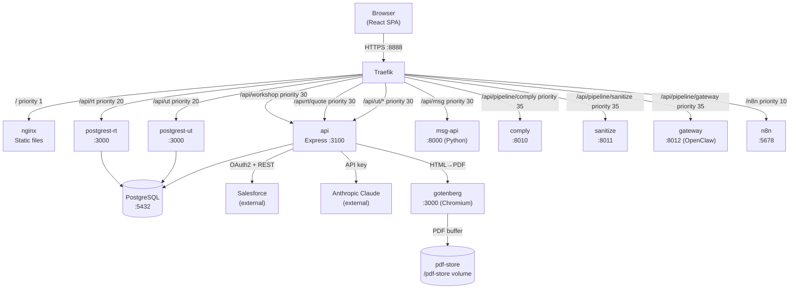
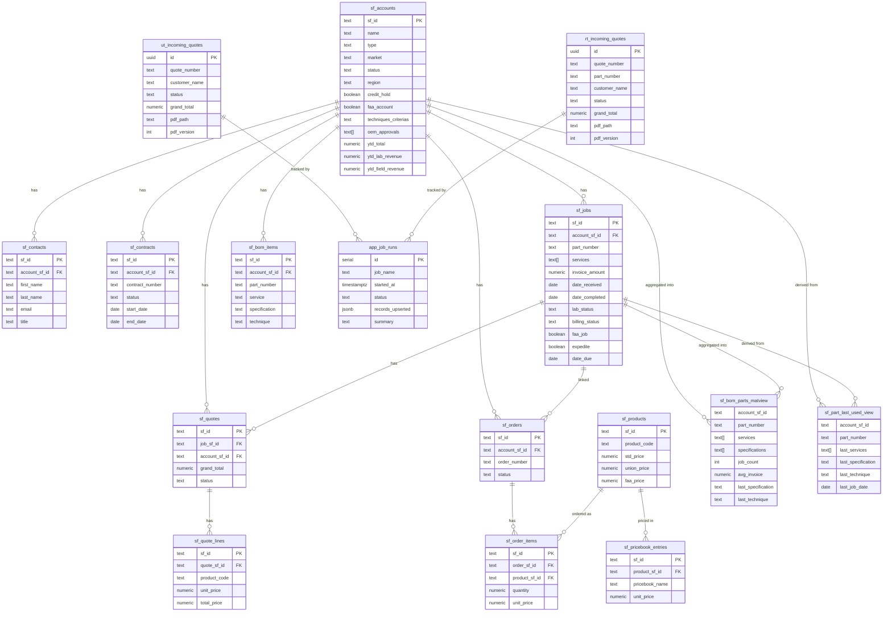
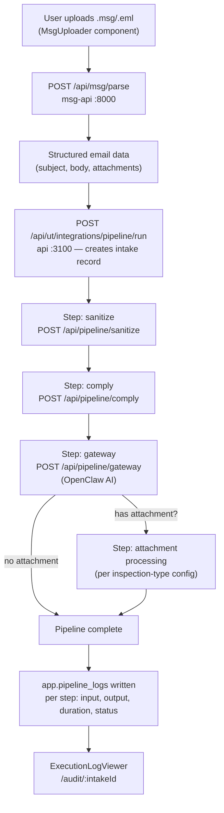
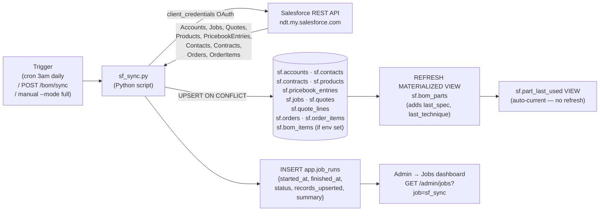
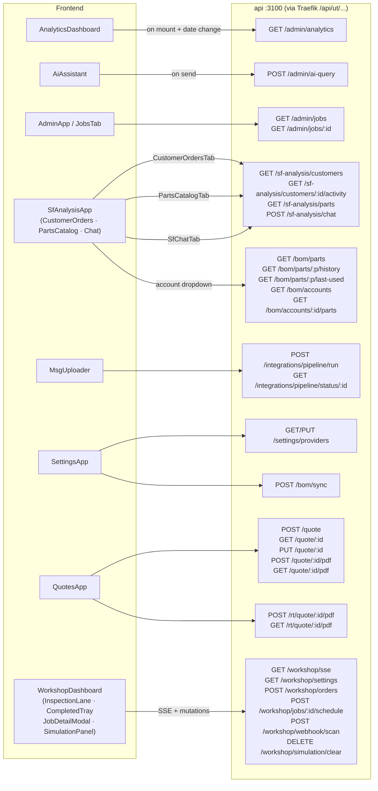
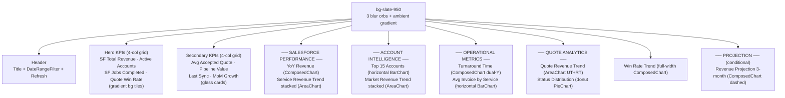
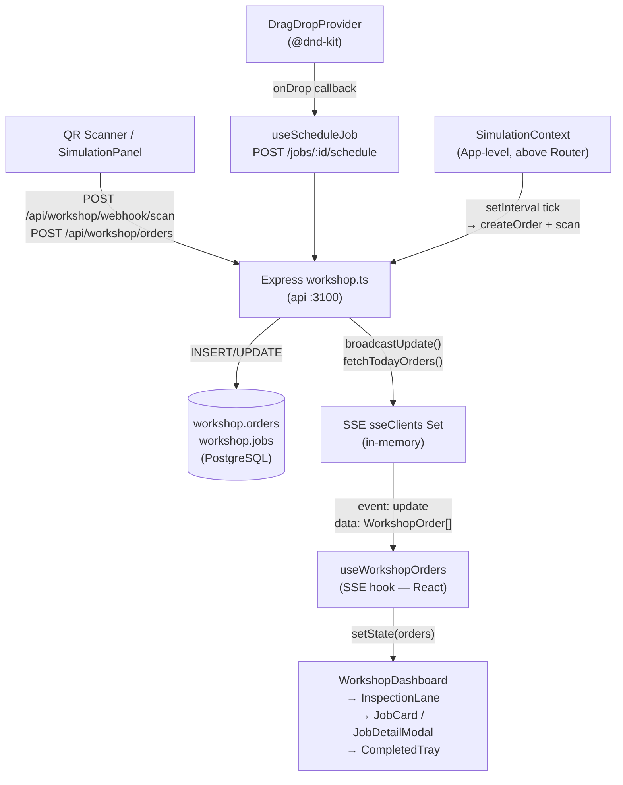

# NDT Portal — Diagrams

> Last updated: 2026-04-04

---

## System Architecture

> How the browser, proxy, services, and database connect.

---

## Database Schema (ERD)

> Key tables and their relationships. `sf.bom_parts` is a materialized view; `sf.part_last_used` is a regular view. Both are derived from `sf.jobs`.

---

## WF-5 Inspection Pipeline Flow

> How an MSG file becomes a structured inspection result.

---

## Salesforce Sync Flow

> How SF historical data lands in PostgreSQL. Read-only from SF — no writes back.

---

## API Call Map (Frontend → Backend)

> Which components hit which endpoints.

---

## Analytics Dashboard — Section Map

> Visual layout of the rebuilt AnalyticsDashboard (dark glassmorphism).

---

## Workshop Dashboard Data Flow

> How real-time updates flow from QR scan / order creation to the dashboard.

