# Engagement Roles & Onboarding Flow

> **Scope:** Complete creation hierarchy for a CMMC Compliance OS engagement, from platform bootstrap through client team member invites.
> **Audience:** Platform owners, MSP operators, and client admins onboarding to the cmmc4msp SaaS.
> **Last updated:** 2026-04-19

---

## Creation hierarchy

```mermaid
flowchart TB
    classDef p0 fill:#fde68a,stroke:#b45309,color:#78350f,stroke-width:2px
    classDef p01 fill:#ede9fe,stroke:#8b5cf6,color:#4c1d95,stroke-width:2px
    classDef p10 fill:#dbeafe,stroke:#3b82f6,color:#1e3a8a,stroke-width:2px
    classDef p11 fill:#d1fae5,stroke:#10b981,color:#065f46,stroke-width:2px
    classDef p12 fill:#f3f4f6,stroke:#6b7280,color:#1f2937
    classDef sys fill:#fce7f3,stroke:#ec4899,color:#831843

    ZERO["<b>0</b><br/>Platform Owner<br/>super_admin<br/><i>Onnex staff</i>"]:::p0

    subgraph S0_1["Phase 0.1 — Platform Owner onboards an MSP"]
        direction TB
        T0a["0 → Creates MSP org<br/>/platform/msps<br/>e.g. 'AirGap Cyber'"]:::p0
        T0b[["Platform creates:<br/>msps row<br/>Authentik group"]]:::sys
        T0c["0 → Creates msp_admin user<br/>Authentik + role + msp_id<br/>Sends welcome email"]:::p0
        T0a --> T0b --> T0c
    end

    ONE_ONE["<b>0.1</b><br/>MSP admin<br/><i>Accepts invite, lands on /msp</i>"]:::p01

    subgraph S1_0["Phase 1.0 — MSP admin creates Client Org"]
        direction TB
        T1a["0.1 → Onboard Client wizard<br/>/msp/clients → New<br/>Name, slug, CAGE, contact"]:::p01
        T1b[["Platform creates:<br/>orgs row + program row<br/>Seeds 110 controls → 407 program_controls<br/>Creates default assignments"]]:::sys
        T1a --> T1b
    end

    ONE_ZERO["<b>1.0</b><br/>Client Organization<br/><i>e.g. Meridian Defense Systems</i>"]:::p10

    subgraph S1_1["Phase 1.1 — MSP admin invites Client admin"]
        direction TB
        T2a["0.1 → Invite client_admin<br/>/msp/clients/{id}/team<br/>email + role=client_admin"]:::p01
        T2b[["Platform:<br/>Authentik magic link email<br/>Creates users row on accept"]]:::sys
        T2c["1.1 → First login<br/>Dashboard + Quick Wins hub<br/>SSP Interview wizard"]:::p11
        T2a --> T2b --> T2c
    end

    ONE_ONE_CL["<b>1.1</b><br/>Client admin<br/><i>Accepts invite, owns engagement</i>"]:::p11

    subgraph S1_2["Phase 1.2 — Client admin invites Team members"]
        direction TB
        T3a["1.1 → Team page → Invite<br/>email + role=client_user<br/>assigns controls to each"]:::p11
        T3b[["Platform:<br/>Invite via Authentik<br/>users row on accept<br/>email with assigned controls"]]:::sys
        T3c["1.2 → First login<br/>Dashboard = My Tasks<br/>Per-control upload workflow"]:::p12
        T3a --> T3b --> T3c
    end

    ONE_TWO["<b>1.2</b><br/>Team members<br/><i>Security engineer, auditor, IT admin...</i>"]:::p12

    subgraph S1_3["Phase 1.3 — Automated work begins"]
        direction TB
        T4a["1.1 → Connect integrations<br/>Entra, Okta, Defender..."]:::p11
        T4b["1.2 (IT admin) → Download harvester<br/>Runs PS1, uploads ZIP"]:::p12
        T4c["1.1 → Bulk Request Evidence<br/>Controls page → assigns 78 controls<br/>to team members 1.2"]:::p11
        T4d[["Platform:<br/>25 ctrls auto-satisfied by integrations<br/>15 ctrls satisfied by harvester<br/>Email blast to team<br/>Claude auto-assesses each upload"]]:::sys
        T4a --> T4d
        T4b --> T4d
        T4c --> T4d
    end

    ZERO --> S0_1
    S0_1 --> ONE_ONE
    ONE_ONE --> S1_0
    S1_0 --> ONE_ZERO
    ONE_ZERO --> S1_1
    S1_1 --> ONE_ONE_CL
    ONE_ONE_CL --> S1_2
    S1_2 --> ONE_TWO
    ONE_TWO --> S1_3
    ONE_ONE_CL --> S1_3

    style ZERO stroke-width:3px
    style ONE_ONE stroke-width:3px
    style ONE_ZERO stroke-width:3px
    style ONE_ONE_CL stroke-width:3px
    style ONE_TWO stroke-width:3px
```

---

## Numbered creation tree

| ID | Entity | Role | Created by | Primary UI |
| --- | --- | --- | --- | --- |
| **0** | Platform Owner (Mr. T) | `super_admin` | Bootstrap seeder | `/platform` |
| **0.1** | MSP admin — e.g. AirGap Cyber | `msp_admin` | **0** at `/platform/msps` → Create MSP + user | `/msp` |
| **1.0** | Client Org — e.g. Meridian Defense | (organization, no user) | **0.1** at `/msp/clients` → Onboard Client wizard | `/[orgSlug]/dashboard` |
| **1.1** | Client admin — e.g. John @ Meridian | `client_admin` | **0.1** via Authentik invite email | `/[orgSlug]/*` (full org access) |
| **1.2** | Team members — Jane, Bob, Alice | `client_user` | **1.1** at `/[orgSlug]/team` → Invite | `/[orgSlug]/tasks` (restricted) |
| 2.0, 3.0… | Additional client orgs | — | **0.1** (same MSP) | same pattern |
| 0.2, 0.3… | Additional MSPs | `msp_admin` | **0** | `/msp` (each isolated to own MSP) |

---

## Step-by-step actions per role

### Step 0 → 0.1: Platform Owner onboards an MSP
*One-time per MSP, ~15 minutes*

1. Log in as `super_admin` at `app.cmmc4msp.on-nex.us`
2. Navigate `/platform/msps` → "New MSP"
3. Fill: MSP name, slug, primary contact
4. Create the first `msp_admin` user — email + name → Authentik invite sent
5. Hand off to the MSP; they own everything downstream

### Step 0.1 → 1.0: MSP admin onboards a client org
*~10 minutes per client*

1. MSP admin accepts invite email → lands on `/msp`
2. Navigate `/msp/clients` → "Onboard Client"
3. Fill wizard: org name, slug, CAGE code, primary contact, CMMC target level
4. Platform auto-seeds 110 controls into 407 `program_control` records and creates a default program

### Step 0.1 → 1.1: MSP admin invites the Client admin

1. Still on `/msp/clients/{id}` → Team tab → "Invite User"
2. Fill: email (e.g. `admin@client.com`), role = `client_admin`
3. Authentik sends magic-link email → user sets password → lands on `/[orgSlug]/dashboard`
4. Client admin then runs the SSP Interview wizard and connects integrations

### Step 1.1 → 1.2: Client admin invites Team members
*~5 minutes per teammate*

1. `/[orgSlug]/team` → "Invite Member"
2. Fill per person: email, name, role = `client_user`
3. Email invite sent → teammate accepts → restricted UI (Dashboard + My Tasks + Controls read-only)

### Step 1.1 → assigns work to 1.2

1. `/[orgSlug]/controls` → select controls via checkbox → "Request Evidence"
2. Pick assignee from dropdown → email blast with list + due dates
3. Team members (1.2) receive email, log in, see tasks in `/[orgSlug]/tasks`, upload evidence

---

## Implementation status

| Step | Component / Page | Status |
| --- | --- | --- |
| 0 → 0.1 | `/platform/msps` + MSP onboard endpoint | Built |
| 0.1 → 1.0 | `/msp/clients` → "Onboard Client" wizard (backed by `/api/orgs/onboard`) | Built |
| 0.1 → 1.1 | Authentik invite flow | Built |
| 1.1 → 1.2 | `/[orgSlug]/team` invite | Built |
| 1.1 → assign | `/[orgSlug]/controls` bulk-request | Built (2026-04-19) |
| 1.1 → integrations | `/[orgSlug]/integrations` | Built + fixed (2026-04-19) |
| 1.1 / 1.2 → Quick Wins hub | `/[orgSlug]/evidence-automation` | Built (2026-04-19) |

All steps functional end-to-end as of 2026-04-19.

---

## Reference identifiers (current demo data)

| Entity | ID |
| --- | --- |
| Demo MSP | AirGap Cyber |
| Demo client org | `meridian-defense` (org_id `a10d9db5-be5e-5f72-bb8e-04cdc3dc1e00`) |
| Demo program | `938dc5cf-c294-5eac-8b71-a805bd387c85` |
| Demo client admin | `admin@meridian-defense.demo` (Authentik pk=9) |
| Demo team members | `engineer@meridian-defense.demo`, `auditor@meridian-defense.demo` |
| Platform super_admin | `akadmin` (Authentik) / `hugh@on-nex.com` |

---

## Sustained effort per role

| Role | Ongoing workload |
| --- | --- |
| **0** — Platform Owner | ~30 min/week (platform health, MSP account creation) |
| **0.1** — MSP admin | Active during onboarding + weekly review of assessments |
| **1.1** — Client admin | Heavy during first 4 weeks of engagement; lighter after audit package generated |
| **1.2** — Team member | Spikes when assigned evidence — typically 1–2 hrs per control |
