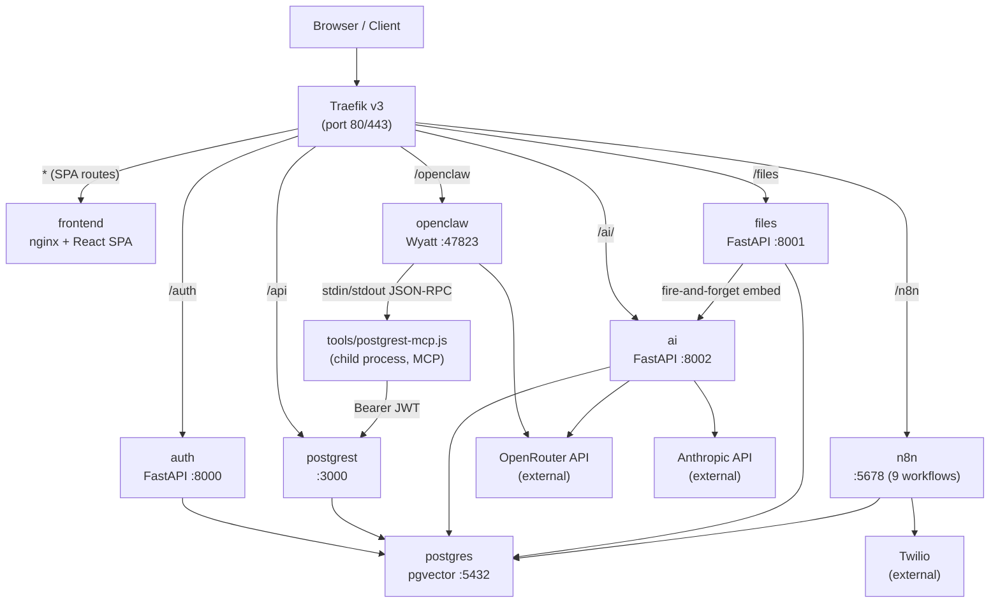
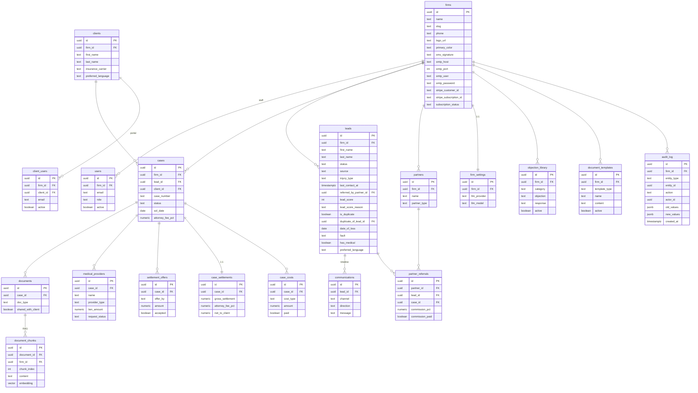
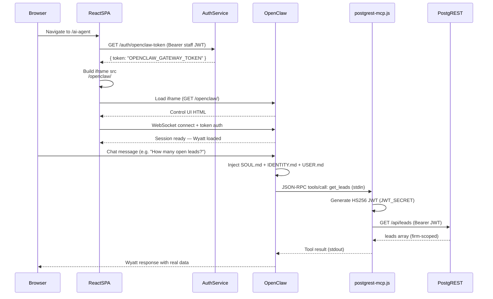
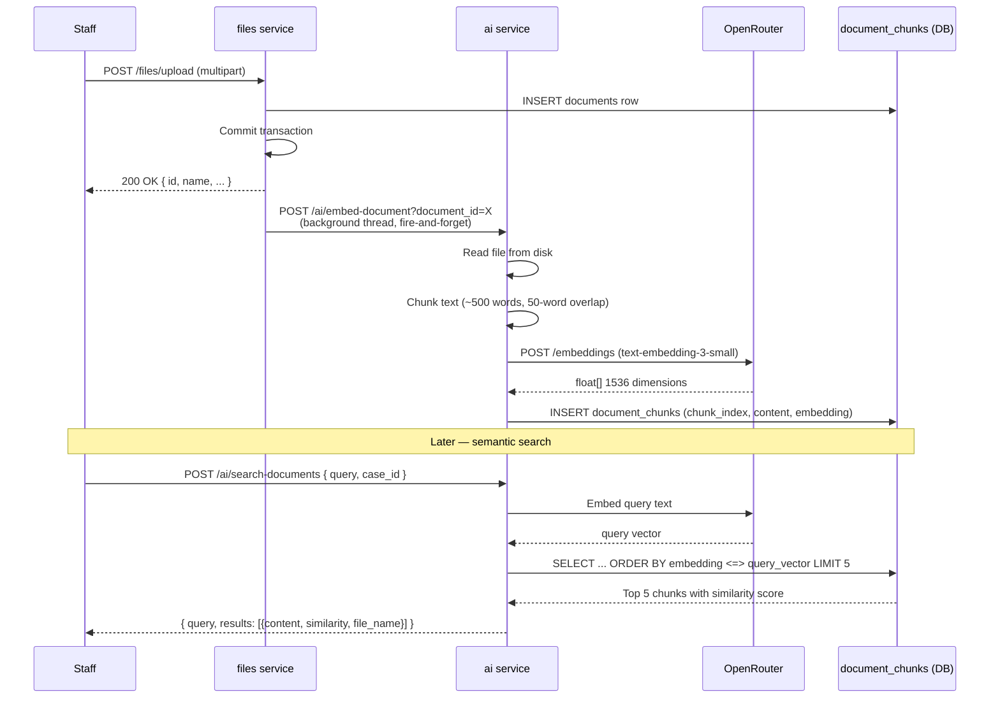
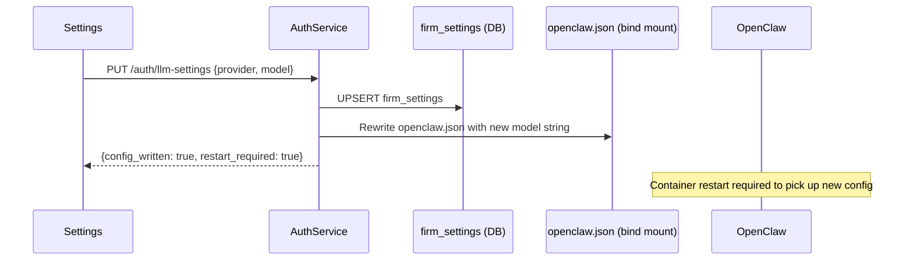
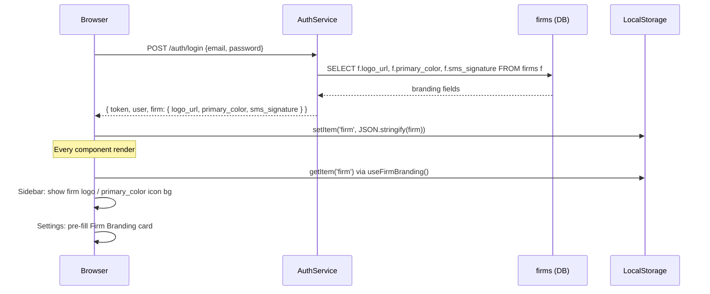

# PI Lawyer OS — Diagrams

> Last updated: 2026-03-20
> Covers changes through: 0323e1a (Phase 12 — Platform Scale, v4.1 complete)

---

## System Architecture

> Overview of Docker Compose services and request routing.

---

## Database Schema (ERD)

> Core tables and foreign key relationships. All tables have `firm_id` FK to `firms`. Phases 07–12 additions shown.

---

## Key Data Flow — Wyatt AI Agent Session

> How a staff user connects to the Wyatt AI agent via the iframe.

---

## Document RAG Flow

> How uploaded documents become searchable by meaning.

---

## Frontend → Backend API Call Map

> Which pages and components call which backend services.

```mermaid
graph LR
    Login -->|"POST /auth/login"| AuthSvc["Auth Service"]
    IntakeForm -->|"POST /auth/intake"| AuthSvc
    Dashboard -->|"GET /api/leads"| PGR["PostgREST"]
    Dashboard -->|"GET /api/lead_funnel_stats"| PGR
    Dashboard -->|"GET /api/partner_performance"| PGR
    Leads -->|"GET /api/leads"| PGR
    LeadDetail -->|"GET /api/leads/:id"| PGR
    LeadDetail -->|"GET /api/communications"| PGR
    LeadDetail -->|"GET /api/audit_log"| PGR
    Cases -->|"GET /api/cases"| PGR
    CaseDetail -->|"GET /api/cases/:id"| PGR
    CaseDetail -->|"GET /api/documents"| PGR
    CaseDetail -->|"GET /api/medical_providers"| PGR
    CaseDetail -->|"GET /api/settlement_offers"| PGR
    CaseDetail -->|"GET /api/case_settlements"| PGR
    CaseDetail -->|"GET /api/audit_log"| PGR
    CaseDetail -->|"POST /ai/generate-demand/:id"| AISvc["AI Service"]
    CaseDetail -->|"POST /ai/analyze-document"| AISvc
    CaseDetail -->|"GET /ai/similar-cases/:id"| AISvc
    CaseDetail -->|"POST /ai/search-documents"| AISvc
    CaseDetail -->|"POST /files/upload"| FilesSvc["Files Service"]
    Partners -->|"GET /api/partners"| PGR
    PartnerDetail -->|"GET /api/partner_referrals"| PGR
    Analytics -->|"GET /api/lead_funnel_stats"| PGR
    Analytics -->|"GET /api/case_stage_stats"| PGR
    Analytics -->|"GET /api/partner_performance"| PGR
    Analytics -->|"GET /api/source_attribution_stats"| PGR
    Analytics -->|"GET /api/attorney_performance"| PGR
    AIAgent -->|"GET /auth/openclaw-token"| AuthSvc
    AIAgent -->|"GET /auth/llm-settings"| AuthSvc
    Settings -->|"GET /auth/llm-settings"| AuthSvc
    Settings -->|"PUT /auth/llm-settings"| AuthSvc
    Settings -->|"GET /api/firms"| PGR
    Settings -->|"PATCH /api/firms"| PGR
    Settings -->|"GET /api/objection_library"| PGR
    Settings -->|"PATCH /api/objection_library"| PGR
    Settings -->|"GET /api/document_templates"| PGR
    Settings -->|"PATCH /api/document_templates"| PGR
    Settings -->|"GET /auth/list-users"| AuthSvc
    Settings -->|"POST /auth/create-user"| AuthSvc
    Settings -->|"PATCH /auth/update-user/:id"| AuthSvc
    PortalLogin -->|"POST /auth/portal-login"| AuthSvc
    ClientPortal -->|"GET /api/cases/:id"| PGR
    ClientPortal -->|"GET /api/documents (shared)"| PGR
```

---

## LLM Settings Flow

> How changing the LLM in Settings propagates to OpenClaw.

---

## White-Label Branding Flow

> How per-firm branding flows from DB to every user session.

