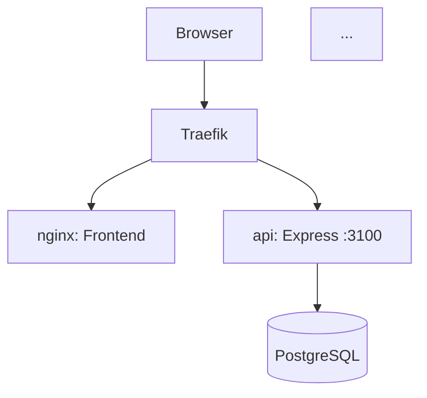
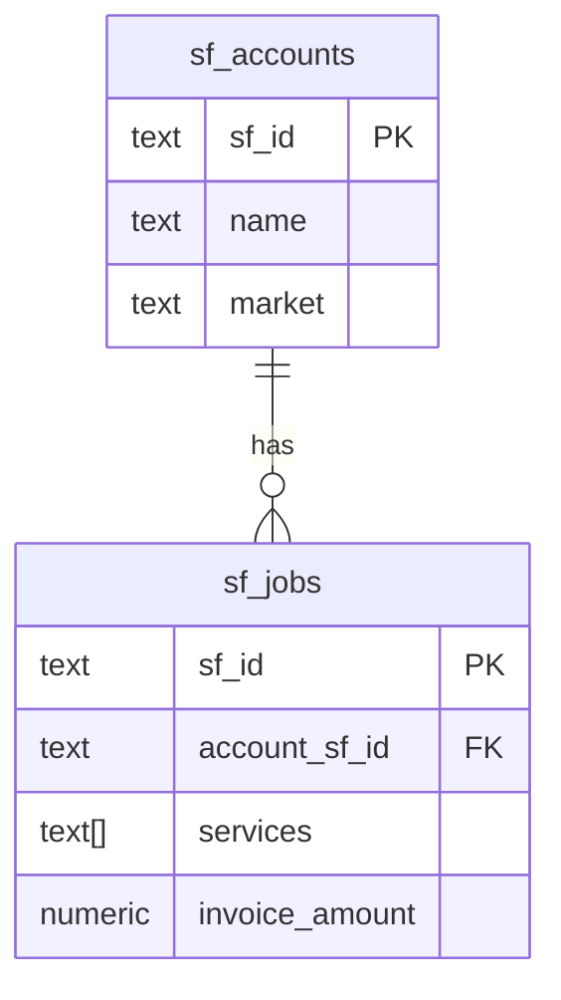
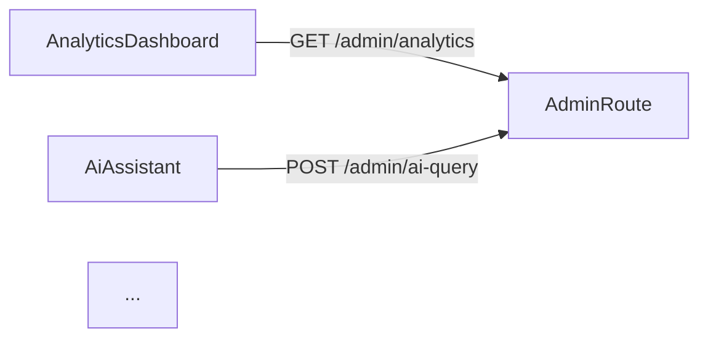

# Update Project Docs

> Audit all changes since the last doc update, refresh architecture + API reference + diagrams, commit everything, and push.

---

## Step 1: Detect Project Context

Identify where we are:

```bash
git rev-parse --show-toplevel   # workspace root
git rev-parse --abbrev-ref HEAD  # current branch
git remote get-url origin        # remote URL
```

Find the **project root** (the immediate subdirectory of the workspace that contains the active codebase — e.g. `projects/ndt-portal-v1`, `projects/pi-lawyer-os`, `projects/AI-OS-POC`). This is usually the current working directory or its closest ancestor with a `context/` folder.

Locate:
- `context/architecture.md` — main architecture doc (create if missing)
- `context/API.md` — API reference (create if missing)
- `context/diagrams.md` — Mermaid diagrams (create if missing)

---

## Step 2: Find the Change Window

Find the last commit that touched documentation:

```bash
git log --oneline --all -- "context/*.md" "*.md" | head -5
```

Then get everything that has changed in source since then:

```bash
# All files changed since last doc commit (use the SHA from above)
git diff --name-only <last-doc-sha> HEAD

# If no prior doc commit exists, scope to last 30 commits
git diff --name-only HEAD~30 HEAD
```

Also collect uncommitted changes:

```bash
git status --short
git diff --stat HEAD
```

Categorize every changed file into one of:
- **API routes** — `api/src/routes/*.ts`, `apps/api/src/routes/*.ts`, `*/routes/*.py`
- **DB schema / migrations** — `postgres/migrations/*.sql`, `*/migrations/*.sql`, `db/schema.sql`
- **Frontend components** — `frontend/src/components/**`, `apps/web/src/**`
- **Services / Docker** — `docker-compose.yml`, `Dockerfile*`, `traefik*.yml`
- **Config / env** — `.env.example`, `*.yml` config files
- **Types / interfaces** — `*.ts` files with `interface`, `type`, `export`

---

## Step 3: Survey Changed Source

Read every file in the API routes and types categories. For each:
- Identify all HTTP endpoints (`router.get`, `router.post`, `app.get`, `@app.route`, etc.)
- Extract request params, query params, and request body shapes
- Extract response shapes (what `res.json(...)` sends or what the schema returns)
- Note auth requirements, middleware, rate limits

Read changed migration files:
- Identify new tables, columns, indexes added or dropped
- Note schema and table name

Read changed `docker-compose.yml` / service configs:
- New services added, ports changed, dependencies changed

Read changed frontend component files:
- New pages/routes added
- New major UI features
- New API calls made (fetch/axios URLs)

---

## Step 4: Update `context/architecture.md`

Rewrite or patch the architecture doc to reflect current state. Structure:

```markdown
# [Project Name] — Architecture

> Last updated: [today's date]
> Covers changes through: [latest git SHA short]

## Overview
[2–3 sentence description of the system]

## Frontend
[Stack, how it's served, auth model if any]

### Route Map
| Path | Component | Description |
|------|-----------|-------------|
[all frontend routes — add/update/remove as needed]

### Key Components
[Major component groups — dashboards, forms, panels]

## Backend
[Stack, port, how routes are mounted]

### Route Structure
| Prefix | File | Description |
|--------|------|-------------|
[all backend route groups]

### API Endpoints
[Key endpoints with params and return shapes — link to API.md for full detail]

## Database
[DB type, connection approach]

| Schema | Purpose |
|--------|---------|
[all schemas / namespaces]

### Recent Schema Changes
[Changes since last doc update — new tables, columns, migrations]

## Services (Docker Compose)
| Service | Port | Description |
|---------|------|-------------|
[all services]

## Routing / Proxy
[Traefik / nginx / reverse proxy rules — key routes]

## Data Flow
[Brief description of the main data flows — e.g. quote creation, SF sync, pipeline]
See `diagrams.md` for visual representations.
```

**Rules:**
- Preserve existing content that hasn't changed
- Add new sections for new subsystems
- Update existing rows in tables — don't duplicate
- Mark deprecated items as `~~strikethrough~~` rather than deleting (so the history is visible)
- Keep it scannable — prefer tables over prose for enumerations

---

## Step 5: Update `context/API.md`

Full API reference. Structure:

```markdown
# [Project Name] — API Reference

> Last updated: [today's date]
> Base URL: [from env / config]
> Auth: [describe auth mechanism or "none for internal"]

---

## [Route Group: e.g. Admin]

### GET /admin/analytics

**Query params:**
| Param | Type | Default | Description |
|-------|------|---------|-------------|
| start | string (YYYY-MM-DD) | 30 days ago | Range start |
| end   | string (YYYY-MM-DD) | today | Range end |

**Response:**
```typescript
{
  period: { start: string; end: string }
  kpis: { ... }
  quoteTrend: Array<{ month: string; ... }>
  // ... all keys
}
```

**Notes:** [any caveats, SQL overcounting notes, etc.]

---
```

Cover every endpoint in the codebase — not just changed ones. This is a full reference, not a changelog. For endpoints that haven't changed, keep the existing doc. For new/changed ones, update from the source you read in Step 3.

---

## Step 6: Update `context/diagrams.md`

Mermaid diagrams — create or update the following. Only include diagrams that are useful for this project's actual complexity. Skip any that would be trivially simple or redundant.

### 6a. System Architecture Diagram



### 6b. Database Schema (ERD-style)

Show key tables with their primary/foreign key relationships. Use Mermaid `erDiagram` for relational schemas:



### 6c. Key Data Flow (main workflow)

Show the primary user-facing workflow as a sequence or flowchart. For NDT Portal: quote creation → SF sync → analytics. For PI Lawyer OS: intake → case → billing.

### 6d. API Call Map (Frontend → Backend)

Show which frontend components call which backend endpoints:



**Rules:**
- Keep diagrams accurate to the code, not aspirational
- Prefer simple diagrams that are actually maintained over exhaustive ones that rot
- Add a `> Last updated:` note under each diagram heading

---

## Step 7: Stage, Commit, and Push

### 7a. Stage everything

Stage all modified and untracked files within the project scope. Be precise — do not sweep in unrelated project files from siblings:

```bash
cd [project-root]
git add context/architecture.md context/API.md context/diagrams.md
git add [all source files that were changed/new — be specific, not git add -A]
```

If there are untracked files outside the project root (e.g. workspace-level config changes), check with the user before staging those.

### 7b. Compose the commit message

Use conventional commit format. The commit message must:
- Summarize what changed in source (features, fixes, schema)
- Note that docs were updated to match
- Be accurate — don't claim changes that weren't made

Template:
```
docs([project]): update architecture, API ref, and diagrams

Captures changes since [last-doc-sha-short]:
- [major source change 1]
- [major source change 2]
- [major source change 3]

Updated:
- context/architecture.md — [what was updated]
- context/API.md — [what was added/changed]
- context/diagrams.md — [which diagrams were refreshed]

Co-Authored-By: Claude Sonnet 4.6 <noreply@anthropic.com>
```

### 7c. Commit

```bash
git commit -m "$(cat <<'EOF'
[message from 7b]
EOF
)"
```

### 7d. Push

```bash
git push origin [current-branch]
```

Confirm the push succeeded. If it fails due to diverged remote (non-fast-forward), report the conflict to the user — do not force-push.

---

## Step 8: Report

Deliver a concise summary:

```
## Docs Updated — [Project Name]

**Commit:** [sha] on [branch]
**Pushed:** [remote URL / branch]

### Source changes captured:
- [bullet per meaningful source change]

### Docs refreshed:
- **architecture.md** — [what changed: new routes, services, schema, etc.]
- **API.md** — [endpoints added/updated]
- **diagrams.md** — [which diagrams regenerated]

### Files committed: [N files, +X −Y lines]
```

If anything was skipped (e.g. a diagram was too complex to generate accurately without more context), note it and ask if you should attempt it.

---

## Notes

- **Scope discipline:** Only commit files within the active project directory. Never auto-commit secrets (`.env`, `*.key`, `credentials.json`) — skip and warn.
- **Doc-first on ambiguity:** If source code behavior is ambiguous (e.g. an endpoint returns different shapes based on a flag), document both variants with a note rather than picking one.
- **Mermaid accuracy over completeness:** A diagram that's wrong is worse than no diagram. If you can't derive an accurate diagram from the source, write a prose description instead.
- **Idempotent:** Running this command twice in a row should produce a clean `git status` (nothing to commit) after the second run.
